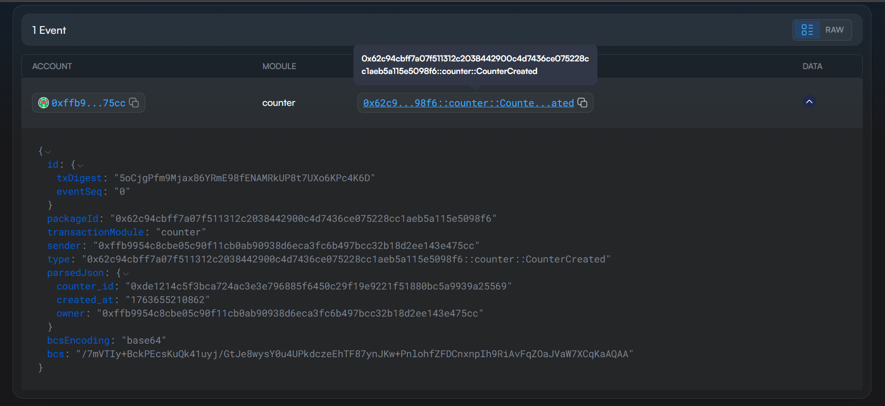
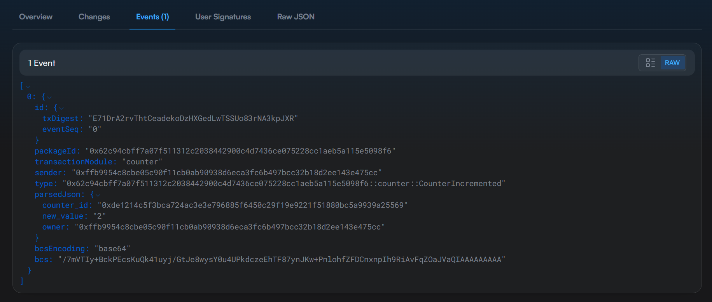
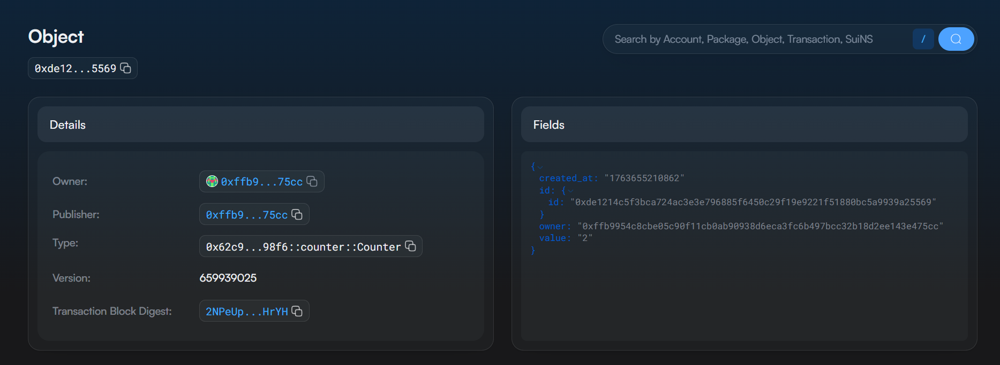

# 🚀 Sui Counter DApp

*A Simple On-Chain Counter Built with Sui Move*

## 📌 Overview

This project implements a **simple decentralized on-chain Counter DApp**.

Each user can:

- **Create their own personal Counter object**
- **Increment it on-chain**
- **Read its value at any time**

---

# 🔧 Smart Contract: Features & Architecture

The core of the DApp is implemented inside the module:

```
counter::counter
```

---

## 🧱 On-Chain Object: `Counter`

Each counter is a **Sui Move object with key ability**, containing:

| Field        | Type     | Description                                      |
|--------------|----------|--------------------------------------------------|
| `id`         | `UID`    | Unique Sui object ID                             |
| `owner`      | `address`| The owner address who created the counter        |
| `value`      | `u64`    | Current counter value (initially 0)              |
| `created_at` | `u64`    | Timestamp in milliseconds from the global Clock |

---

# ⚙️ Implemented Functions

### ✔ `create_counter(clock: &Clock, ctx: &mut TxContext)`
Creates a new Counter owned by the caller.

### ✔ `increment(counter: &mut Counter, ctx: &TxContext)`
Increments the counter **only if the caller is its owner**.

### ✔ `get_value(counter: &Counter)`
Returns the counter value.

---

# 📦 Events

- **CounterCreated**
- **CounterIncremented**

---

# 🛡 Error Handling

```
const E_NOT_OWNER: u64 = 1;
```

---

# 🌐 Deployment to Sui Testnet

### 📦 Package ID

```
0x62c94cbff7a07f511312c2038442900c4d7436ce075228cc1aeb5a115e5098f6
```

### 🔑 Publish Transaction Digest

```
EwCiwZ5EZ8wQYKbNjAy3LGgxYbKftMfs7WpUJUZ8SzvR
```

---

# 🧪 CLI Usage

## ✅ Create a Counter

```
sui client call   --package 0x62c94cbff7a07f511312c2038442900c4d7436ce075228cc1aeb5a115e5098f6   --module counter   --function create_counter   --args 0x6   --gas-budget 10000000
```

### **Example Output (Real Counter ID)**

After running the above command, a new Counter object was created:

```
Counter Object ID:
0xde1214c5f3bca724ac3e3e796885f6450c29f19e9221f51880bc5a9939a25569
```

---

## ✅ Increment Counter

```
sui client call   --package 0x62c94cbff7a07f511312c2038442900c4d7436ce075228cc1aeb5a115e5098f6   --module counter   --function increment   --args 0xde1214c5f3bca724ac3e3e796885f6450c29f19e9221f51880bc5a9939a25569   --gas-budget 10000000
```

Expected event:

```
CounterIncremented {
  owner: 0xffb9954c8cbe05c90f11cb0ab90938d6eca3fc6b497bcc32b18d2ee143e475cc,
  counter_id: 0xde1214c5f3bca724ac3e3e796885f6450c29f19e9221f51880bc5a9939a25569,
  new_value: 2
}
```

---

# 📸 Suivision Screenshots

## ✔ Counter Created Event  


## ✔ Counter Incremented Event  


## ✔ Counter Object Details  


---

# 📚 Resources

- https://docs.sui.io/concepts/sui-move-concepts  
- https://suiscan.xyz/testnet/home  
- https://examples.sui.io/  
